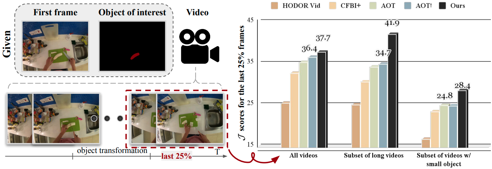

# TAM-VT: Transformation-Aware Multi-scale Video Transformer for Segmentation and Tracking

This is the official repository of [TAM-VT](https://arxiv.org/abs/2312.08514). We now support training and testing on VOST dataset. This work is still under submission. Please stay tune there!



## 🏢 Environment setup

Ubuntu 20.04, python version 3.9, cuda version 11.3, pytorch 1.12.1

- conda create -n vost python=3.9
- conda activate vost
- conda install pytorch==1.12.1 torchvision==0.13.1 torchaudio==0.12.1 cudatoolkit=11.3 -c pytorch
- pip install -r requirements.txt
- python -m pip install 'git+https://github.com/facebookresearch/detectron2.git'

## Dataset

Please visit [VOST official website](https://www.vostdataset.org/data.html) for downloading the dataset.

You can also download the training and validation set videos and annotations under this [link](https://tri-ml-public.s3.amazonaws.com/datasets/VOST.zip).

## 🚀 Training
Please refer to the sbatch scripts in `scripts/vost_train.sh` for more details.

1. Please first modify the [config](config/vost_multi_scale_memory.yaml) to match the dataset path.

2. Please download the pre-trained weight on static images and put the checkpoint in the `checkpoints/`.

    [Pretrained weight on Static datasets](https://drive.google.com/file/d/1ibmXIgRTIXP4pHzBOEfYCc7MFrngVWcc/view?usp=sharing)

2. Run the training script.
    ```
    bash scripts/vost_train.sh
    ```

## 🚀 Evaluation on VOST

Please refer to the sbatch scripts in `scripts/vost_eval.sh` for more details.

1. Please download the model weight on VOST and put the checkpoint in the `checkpoints/`.

    [Model weight on VOST](https://drive.google.com/file/d/1Cw5v6DvwqtPJD_37STRuJo5cv52Tk3xb/view?usp=sharing)

2. Run the training script.
    ```
    bash scripts/vost_eval.sh
    ```

## 📐 VOST Evaluation
To evaluate the predicted results using VOST evaluation scripts, we first need to obtain the predicted results in the VOST format.
 
1.  first add these augs into the eval script: 
    > eval=True 
    > 
    > eval_flags.plot_pred=True 
    > 
    > eval_flags.vost.vis_only_no_cache=True
    >
    > eval_flags.vost.vis_only_pred_mask=True

This allows you to predict the results iteratively and plot all the results. The results will be saved in the defined "output" directory with the following file structure.
```
tamvt_eval
└───plot_pred
│   └───555_tear_aluminium_foil
│   │   └───object_id_1
│   │       └───frames
│   │       │   └───frame00012.png
│   │       │   │   ...
│   │       │   └───frame00600.png
│   │       └───reference_crop.jpg
│   └───556_cut_tomato
│   │   ...
│   └───10625_knead_dough
│ 
```

2. To get the evaluation score, please follow the protocol in the [VOST repo](https://github.com/TRI-ML/VOST).
```
python3 evaluation/evaluation_method.py --set val --dataset_path [PATH_TO_VOST_DATASET] --results_path [PATH_TO_PRED_DIR]
```
Example:
```
python3 evaluation/evaluation_method.py --set val --dataset_path ../datasets/VOST/VOST/ --results_path [PATH_TO_plot_pred_DIR] ./checkpoints/tamvt_eval/plot_pred
```

### Some tips for evaluation
> **You might need to ```pip install pandas``` to install the package.**
> 
> **Please use a cluster with at least 32 GB of memory and an 8+ core CPU, or it will reach the memory limit and be terminated.**

